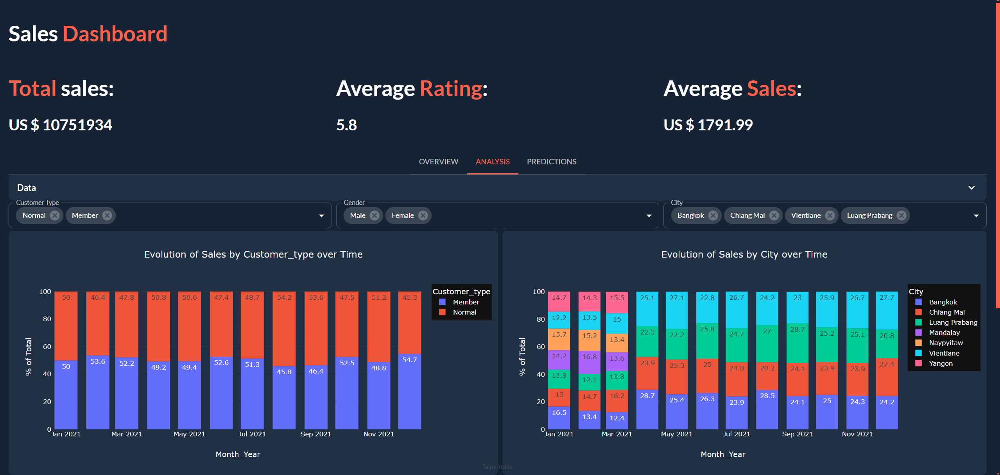
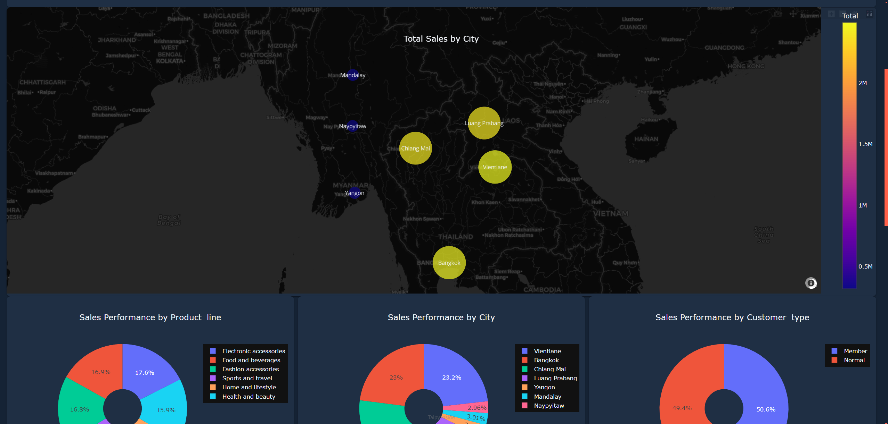
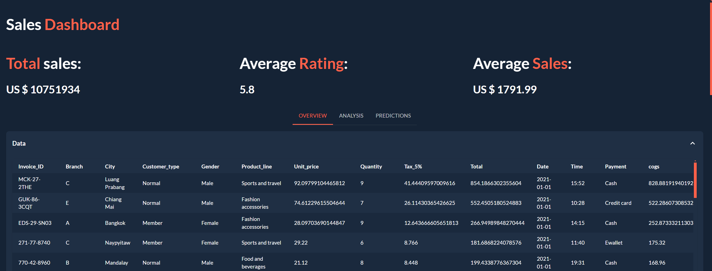
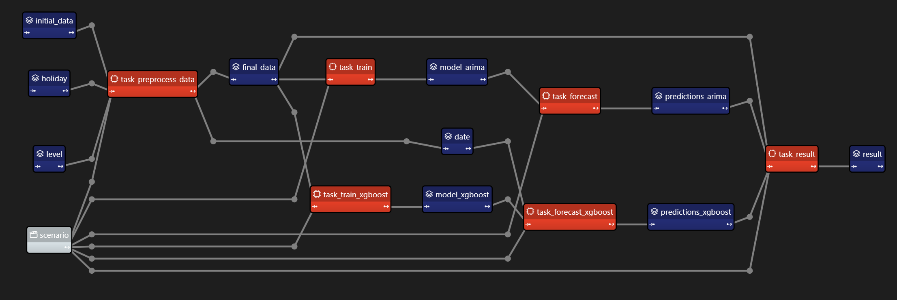
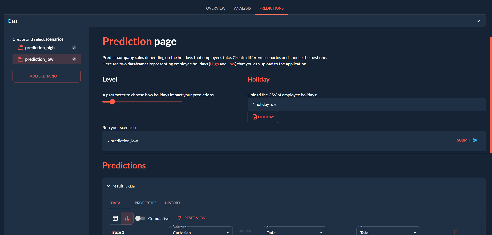
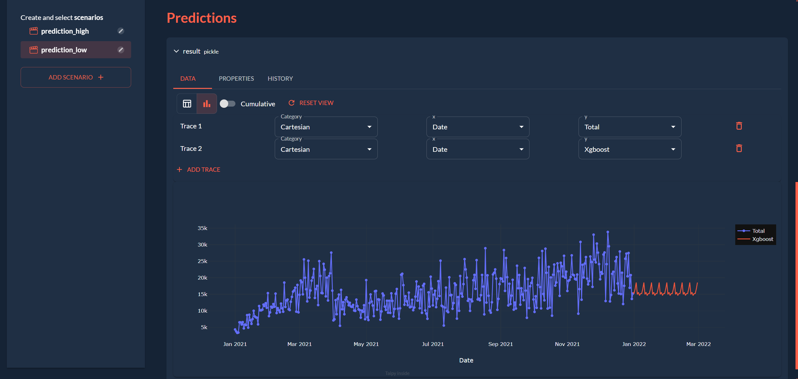

# Taipy Workshop

  

In this workshop, we are going to use Taipy to create a web-based sales dashboard using Python only. The dashboard will show general metrics, plots and a map of sales data. We will also create a page to make predictions based on the sales data.

Check out Taipy's documentation [here](https://docs.taipy.io/en/latest/)

## Installing dependencies
1. Create a virtual environment
2. Install dependencies with `pip install -r requirements.txt`

## Creating the Overview page
This page will contain a map and a few plots of the sales data.

  

Go to pages `pages/Overview/Overview.py` and follow the instructions there. You can find an example of how plots and layouts work in Taipy in `examples/plot.py`

## Visualizing the Overview page

1. Go to `main.py` at the root of the project and:
    a. Import the `Overview.py` file
    b. Add the entry `"Overview": Overview` in first place in the `pages` dictionary

2. Run `taipy run main.py` and take a look at your page!

## Creating the Analysis page

This page will contain plots as well as selection widgets to filter the data.

  

Go to `pages/Analysis/Analysis.py` and follow the instructions there. You can find an example of how selectors work in Taipy in `examples/selector.py`

## Creating a shared header for all pages

We will now add a header to show some general metrics in all pages, as well as a navbar to navigate between pages.

  

The header is already written in `pages/root.md`. All you have to do is load the page within `pages/root.py` using `Markdown(filepath)`; import it in `main.py` and add it to the `pages` dictionary as the first entry with the key `"/"`.

## Creating the Predictions page

In this part, we will configure the following prediction pipeline:

  

Go to `configuration/config.py` and follow the instructions there to learn about data nodes, tasks and scenarios. You can find an example of how to create a prediction pipeline in `examples/config.py`

You can then run `main.py` and interact with the predictions page to submit a scenario and see the results.

  

  

